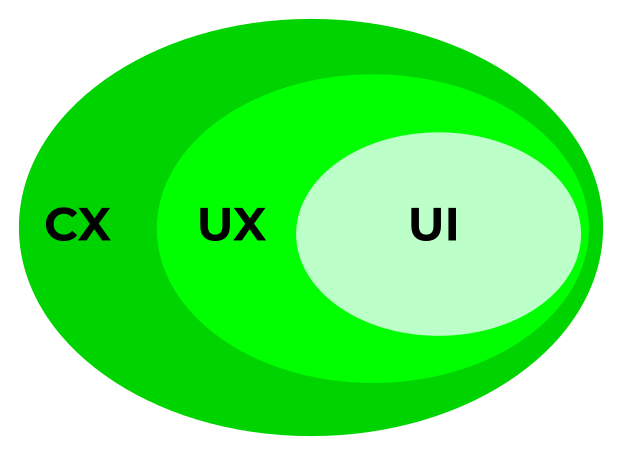
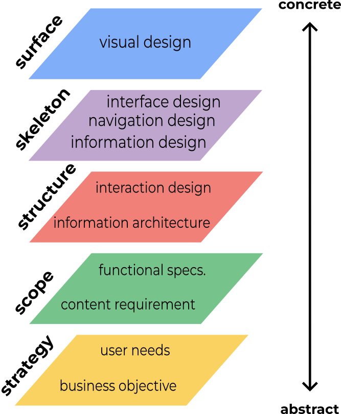

# Overview UI-UX

## 1. UI and UX Overview

### I. UI (User Interface)
The objective is to create a visual experience that includes all visual components on the product page as well as points of visual interaction within the product page.  
UI represents the aesthetic values of the product which ultimately have an impact on the user's experience when interacting with the product.

### II. UX (User Experience)
Aims to create relevant and meaningful experiences while users interact with the product.  
UX includes the entire product design.

### III. CX (Customer Experience)
The customer's experience has of the brand/organization (not only in product level) throughout all the touchpoints that take place during customer interaction with the brand's product before and after conversion.

### IV. UI-UX-CX relationship
CX includes all interactions with users/ customer (not only within product page).
While UX includes the user experience in interacting within the product.
Unlike both of them, UI focuses more on the visual experience aspect of a product.  
Therefore, these three aspects mutually influence the user's experience/sentiment towards the product or brand.

    

### V. Users Goals vs Business Goals
Generally, the main goal of UX is to increase user satisfaction with the product. This is also called **user goals**.
However, you also need to pay attention to **business goals**.
Therefore, in developing UX design, it is necessary to find the optimal point between user goals and business goals.

## 2. UX Fundamental

### I. Elements of UX design 

    

UX design = steps to turn ideas into products.

There are five elements of UX design. 
Starts from the most abstract layer to the most concrete as following:
1.	Strategy  
The basis of the design goal.
The targets are user needs and business objectives
Action Items can be: user research.

2.	Scope  
The domain is the definition of the product scope.
The target is functional specification & content requirements where development refers to user needs defined in the previous element.

3.	Structure  
Setup user and product interaction design.
The target is information architecture & Interaction Design.

4.	Skeleton  
Related to product layout/product display framework.
The targets are navigation design, interface design, & information design.

5.	Surface  
Visual design that will be seen by users. The target is visual elements such as images, colors, illustrations, icons, animations, and etc.

### II. Usability
